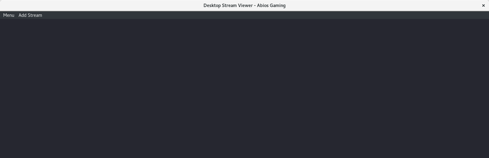

## Introduction
Hopefully you've installed the Desktop Stream Viewer application successfully.
If you haven't, be sure to check out the installation instructions in the 
[README](README.md) before proceeding.

So; the installation went fine and you're presented with the main application 
window as below:

What do you do now?

## Features
The Desktop Stream Viewer application contiains several features that you as a
user should be aware of. As a light introduction to the application we'll 
briefly run through them to be sure we're on the same page before we proceed to
how to use the features.

* Watching multiple streams (Thank you captain obvious):
The Desktop Stream Viewer will automatically arrange the streams for you in a 
neat grid layout, where every stream is the same size. How many streams that 
you can have running at the same time depends on the hardware and internet speed
that you have available.

* Play/Pause individual streams:
You have the ability to pause a livestream during broadcasting. 

**Note:** Remember that is you as a user that is responsible to start the 
video again after you've paused it. Desktop Stream Viewer will kindly obey it's 
master (you) and naively cache the video content, so if you forget to start a 
stream again after you've paused it the application will starve itself to death 
by caching to much memory.

* Rewind individual streams:
If you miss that special moment, you have the ability to rewind the stream and 
watch it again.

* Mute/Unmute all streams at once:
As a neat feature, you have the ability to mute/unmute all the streams at once
if your boss walks into the room.

* Mute/Unmute individual streams:
Of course; the same thing goes for individual streams.

* Specify the quality of the stream:
If the stream provider provides multiple quality options for their stream you're
able to specify in what quality you want to watch.

**Note:** When you change the quality, the buffer for the stream is emptied and 
you won't have the ability the rewind the stream to watch any content before you 
changed the quality.

* Schedule stream to open at a specific time:
Say that you know that your favorite stream starts broadcasting at 22:00. Add 
this time to the Desktop Stream Viewer and it will automatically open the stream
at that time.

* Open recent streams:
The URL:s for the 30 most recent opened streams are saved in memory and is 
available to be reopened from the UI.

* Export/Import streams:
Say that you've opened all your favorite 20 streams and you want to share these
streams with a friend. By using the export stream functionality all the 
currently open stream URL:s will be exported to your clipboard. Simply paste 
this into the chat with your friend and he is able to import these streams (also 
from the clipboard) simply by using the import stream functionallity.

* Restore the previous session:
By restoring the previous session, all the opened streams from your previous 
session will be reopened in your current session.

* Swap the positions of two open streams:
If you want to swap the position of two open streams you're able to do so by 
holding down CTRL and clicking on the two streams you want to swap.

* Change default settings:
In the settings panel you can change the default quality options that should be 
used when opening a new stream or wheter a newly opened stream should be muted 
or not by default. You can also change things like if the rewind functionality 
should be enabled and if so, how big the buffer for the rewinded content should 
be.

**Note:** Rememeber that the amount of rewinded content is determined by the 
buffer size, so if you watch high quality streams you'll need a bigger buffer 
than if you watch low quality streams.

## Information about the UI
As a user you'll be presented with most of the above functionality directly via
menu tabs in the UI. 

The following functionality is placed in the menu bar:
* Menu/Mute - Mute/Unmute all currently open streams.
* Menu/Export Session - Export the currently open stream URL:s to the clipboard.
* Menu/Import Session - Import streams URL:s to the current session.
* Menu/Settings - Opens the settings panel.
* Add Stream/New - Opens a new streams.
* Add Stream/Schedule New Stream - Open a new stream at a specified time.
* Add Stream/Restore Previous Session - Reopen the streams that you had open
last time you used the program.
* Add Stream/Recent - The recently opened streams.

The following functionality is placed in the context menu (right click on a 
stream):
* Mute - Mutes the frame that was right clicked.
* Rewind - Opens a new window with the stream rewinded.
* Reload - Reloads the streams from the stream provider.
* Open chat - opens the stream chat in a browser for Twitch streams. Other 
streams will simply open the video URL in a browser.
* Change quality - Lists all the available quality options for the stream with 
the ability to switch quality option directly by clicking an entry.

The following functionality is presented upon hovering over a stream:
* (Pause/Play) - Pause/Play a stream simply by pressing the pause/play button in the bottom left corner of the frame.
* Delete frame - Removes a frame from the grid by pressing the cross button in the top right corner of the frame.

The following functionality is hidden from the user:
* Swap frames - Swap two frames (A & B) by holding down CTRL, clicking on stream
A and then on stream B.
* (Pause/Play) - Pause/Play a stream simply by clicking on a streams video.
* Fullscreen - Double click on a stream to open that stream in fullscreen mode. 
